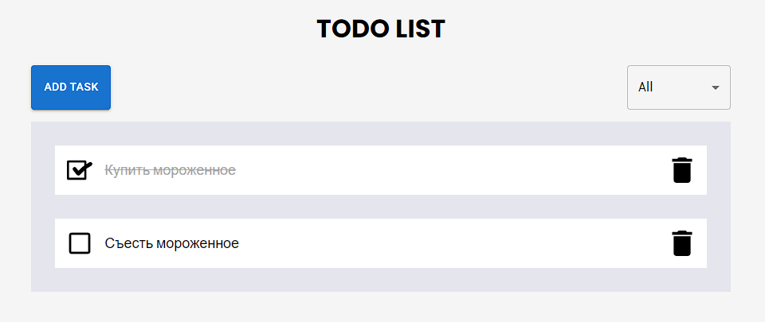

# TODO APP

## Тестовый проект по созданию приложения, позволяющего управлять списком дел



В приложении реализован следующий функционал:

- создание заметки
- удаление заметки
- изменение статуса заметки
- сортировка по статусу

## Deploy

[](https://todo-8om2.onrender.com/)

## Scripts

Запуск проекта:

```
npm install
npm run start
```

Запуск в режиме разработки:

```
npm run dev
```

Сборка проекта:

```
npm run build
```

Запуск тестов:

```
npm run test
```

## TODO

- [ ] Добавить группировку задач

- [ ] Добавть дополнительные тесты

- [ ] Добавить возможность редактировать текст заметки

## Stack


